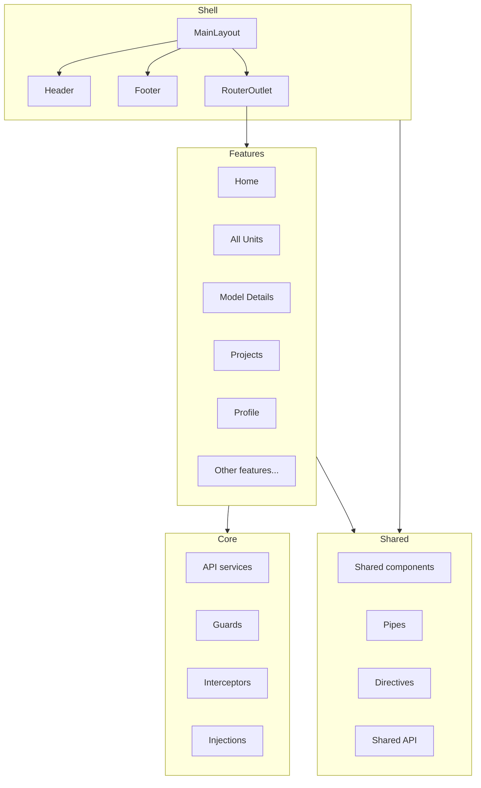
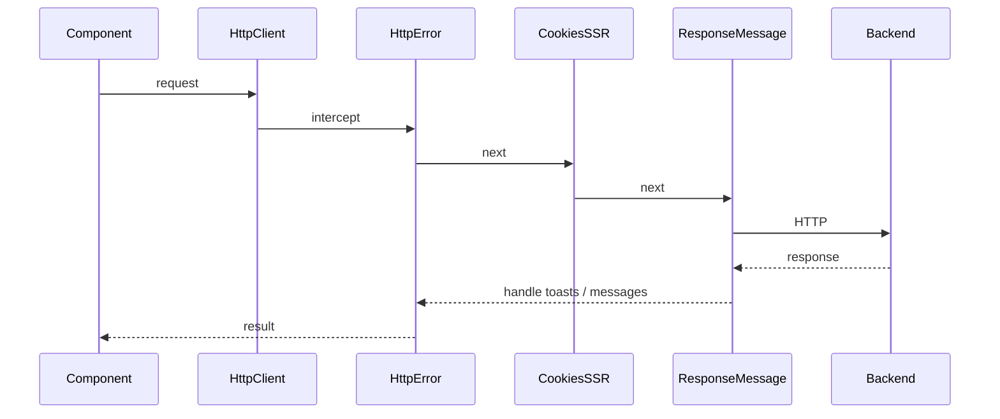

# Architecture Overview

This document describes the high-level architecture of the loveResale customer frontend (VSO real estate e-commerce).

## Tech Stack

- **Angular 21** – Framework (standalone components, signals, zoneless change detection)
- **PrimeNG 21** – UI components and theming (`@primeuix/themes`, `primeng`)
- **Transloco** (`@jsverse/transloco`) – Internationalization (EN / AR, RTL)
- **Angular SSR** – Server-side rendering for SEO and initial load
- **NgRx Signals** – State (e.g. search, user state)
- **angular-svg-icon** – Shared SVG icon component
- **Swiper** – Carousels; **Zoom SDK** – Meetings; **socket.io-client** – Real-time

## Application Layers

The app is organized into four main layers. Each has a single responsibility and clear boundaries.

| Layer | Path alias | Purpose |
|-------|------------|---------|
| **core** | `core/*` | App-wide singletons: API clients, auth, guards, interceptors, injections, constants, validators, utilities. No feature-specific UI. |
| **features** | `features/*` | Business/domain features and pages. One folder per feature; lazy-loaded where applicable. |
| **layout** | `layout/*` | Application shell: MainLayout, header, footer. Composition and responsiveness; no domain logic. |
| **shared** | `shared/*` | Reusable UI (components, pipes, directives) and shared API (e.g. user state, search store). |

## Path Aliases

Defined in `tsconfig.json` under `compilerOptions.paths`:

| Alias | Resolves to |
|-------|--------------|
| `core/*` | `src/app/core/*` |
| `features/*` | `src/app/features/*` |
| `layout/*` | `src/app/layout/*` |
| `shared/*` | `src/app/shared/*` |

Use these in imports instead of relative paths (e.g. `import { authGuard } from 'core/guards'`).

## HTTP Request Flow

All HTTP requests go through a single pipeline of interceptors, then to API services.

- **httpErrorInterceptor** – Global error handling (e.g. 401, 403, server errors).
- **cookiesSSRInterceptor** – Cookie handling for SSR (e.g. forwarding auth cookies).
- **responseMessageInterceptor** – Shows success/error messages (e.g. via PrimeNG MessageService).

Interceptor order is defined in `src/app/core/interceptors/index.ts`.

## Bootstrap and Initialization

Configured in `src/app/app.config.ts`:

- **provideHttpClient** – Fetch API, with the interceptor chain above.
- **provideZonelessChangeDetection** – Angular zoneless mode.
- **provideRouter** – Routes, component input binding, in-memory scroll restoration.
- **provideAppLang** – Language/locale and RTL support.
- **providePrimeNG** – Theme from `src/app/theme.ts`.
- **provideTransloco** – Transloco with HTTP loader and available langs from `core/constants/app`.
- **provideAppInitializer** – `AppInitializeService.initialize()` on app start.
- **provideEnvironmentInitializer** – `IconLoaderService.loadIcons()` before app stabilizes.
- **provideClientHydration** – SSR hydration with event replay.

## Root Structure

- **`src/app/`** – App shell (`app.config.ts`, `app.routes.ts`, `app.component`, `theme.ts`), layout, core, features, shared.
- **`src/styles/`** – Global SCSS (abstracts, base, components, vendor); entry is `src/styles.scss`.
- **`public/`** – Static assets; `public/i18n/` holds `en.json` and `ar.json` for Transloco.

For routing details see [ROUTING.md](ROUTING.md). For core API domains and infrastructure see [CORE.md](CORE.md).
