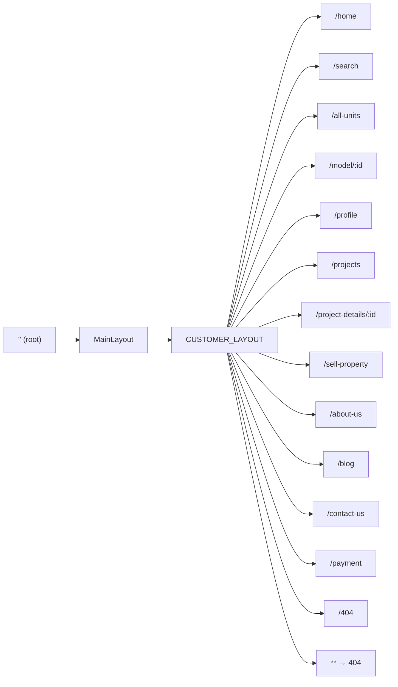

# Routing

This document describes the route tree and how routes are loaded.

## Route Tree

The root route uses `MainLayout` as the shell. All customer routes are children of this layout and are defined in `CUSTOMER_LAYOUT` (see `src/app/layout/main-layout.route.ts`).

## Route Table

| Path | Load | Guard | Resolver | Notes |
|------|------|-------|----------|--------|
| `''` | — | — | — | Redirects to `home` (full). |
| `home` | `Home` (lazy component) | — | — | Home page. |
| `search` | `SEARCH_ROUTES` (lazy children) | — | — | Search feature routes. |
| `all-units` | `ALL_UNITS_ROUTES` (lazy children) | — | — | All units listing. |
| `model/:id` | `ModelDetails` (lazy component) | — | `model: ModelResolver` | Unit details; model preloaded by resolver. |
| `profile` | `Profile` (lazy component) | — | — | User profile. |
| `projects` | `PROJECTS_ROUTES` (lazy children) | — | — | Projects listing. |
| `project-details/:id` | `PROJECT_DETAILS` (lazy children) | — | — | Project detail pages. |
| `sell-property` | `AddProperty` (lazy component) | — | — | Add/sell property. |
| `about-us` | `AboutUs` (lazy component) | — | — | About us page. |
| `blog` | `BLOG_ROUTES` (lazy children) | — | — | Blog feature routes. |
| `contact-us` | `ContactUs` (lazy component) | — | — | Contact page. |
| `payment` | `Payment` (lazy component) | — | — | Payment page. |
| `404` | `NotFoundComponent` (from shared) | — | — | Not found page. |
| `**` | — | — | — | Redirects to `404`. |

## Source Files

- **Root routes:** `src/app/app.routes.ts` – single route with `MainLayout` and `children: CUSTOMER_LAYOUT`.
- **Customer layout routes:** `src/app/layout/main-layout.route.ts` – defines `CUSTOMER_LAYOUT` and imports `authGuard`, `ModelResolver`.

## Guards

- **authGuard** (`core/guards`) – Used where a route requires an authenticated user. Resolves `UserStateService.currentUser`; redirects to `/home` if not authenticated. (Currently not applied in the snippet above; can be added to `profile` or other protected routes as needed.)

## Resolvers

- **ModelResolver** (`core/api/model-details/resolver/model-resolver`) – Used on `model/:id`. Preloads the model (unit) data so `ModelDetails` can use it via the router (e.g. `route.data` or component input binding).

## Lazy Loading

- **Components** – `loadComponent: () => import('features/...').then(c => c.X)`.
- **Child routes** – `loadChildren: () => import('features/.../...route').then(m => m.ROUTES_CONSTANT)`.

Feature route files export a `Routes` array (e.g. `SEARCH_ROUTES`, `ALL_UNITS_ROUTES`, `PROJECTS_ROUTES`, `PROJECT_DETAILS`, `BLOG_ROUTES`) that define the sub-routes for that feature.

## Scroll Restoration

The router is configured with `withInMemoryScrolling({ scrollPositionRestoration: 'enabled' })` in `app.config.ts`, so scroll position is restored on back/forward navigation.
